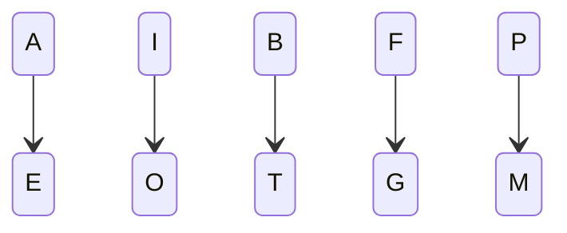

# CryptoLab Encoder 

Herramienta de encriptado online.

## Hashes
 - MD5
 - SHA-1
 - SHA-256
 - SHA-512

> [Lifetimes of cryptographic hash functions](https://valerieaurora.org/hash.html)

## Malespin Code.

Algoritmo simple de sustitución polialfabética.

